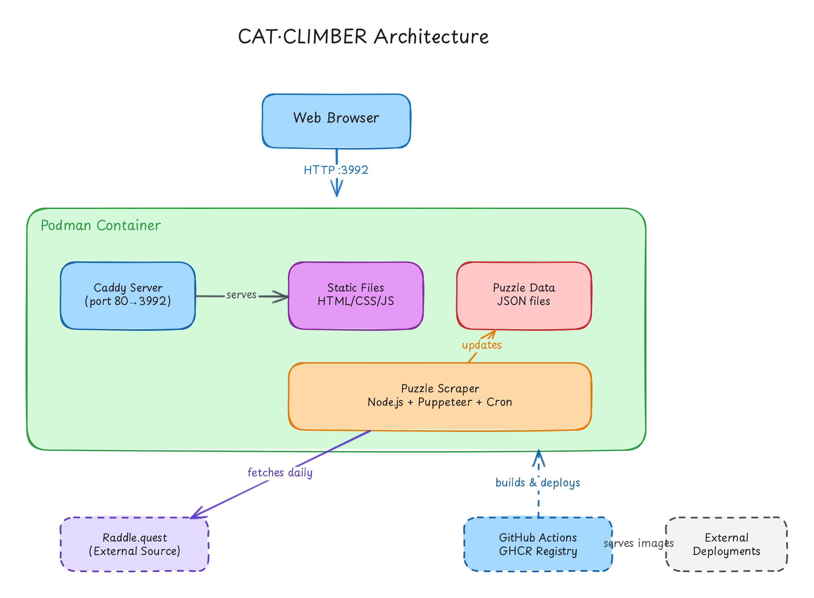

# CAT·CLIMBER Architecture

This document describes the system architecture and components of the CAT·CLIMBER word ladder puzzle game.

## System Overview

CAT·CLIMBER is a containerized static web application that serves word ladder puzzles. The system consists of:

- **Client-side**: Vanilla JavaScript application running in web browsers
- **Server-side**: Caddy web server serving static assets
- **Data pipeline**: Automated puzzle scraper that fetches daily puzzles
- **Deployment**: Containerized application distributed via GitHub Container Registry

## Architecture Diagram



_View the [editable diagram](docs/diagrams/cat-climber-architecture.excalidraw) in [Excalidraw](https://excalidraw.com) or VS Code with the Excalidraw extension._

## Components

### 1. Web Browser (Client)

The client application runs entirely in the user's browser with no server-side processing required.

**Technology Stack:**
- Vanilla JavaScript (no frameworks)
- HTML5 & CSS3
- Responsive design for desktop and mobile

**Key Features:**
- Real-time word validation
- Visual feedback for correct/incorrect entries
- Keyboard navigation
- Shuffled clues for increased challenge
- Answer reveal functionality

### 2. Caddy Server

Caddy serves as a lightweight, high-performance web server inside the container.

**Configuration:**
- Listens on port 80 (mapped to 3992 externally)
- Serves static files from `/usr/share/caddy`
- Gzip compression enabled
- Security headers configured
- JSON logging to stdout

**Served Content:**
- `index.html`, `archive.html` - Main application pages
- `styles.css`, `archive-styles.css` - Stylesheets
- `script.js`, `archive-script.js` - Application logic
- `collected-puzzles.json` - Puzzle data
- Static assets (logo, images)

### 3. Static Files

The application consists of pure static files with no build step required.

**File Structure:**
```
public/
├── index.html              # Main puzzle interface
├── archive.html            # Puzzle archive browser
├── styles.css              # Main styles
├── archive-styles.css      # Archive styles
├── script.js               # Game logic
├── archive-script.js       # Archive logic
└── collected-puzzles.json  # Puzzle data
```

### 4. Puzzle Data (JSON)

Puzzles are stored in JSON format and loaded dynamically by the client.

**Data Structure:**
```json
{
  "date": "2024-01-15",
  "start": "SAVE",
  "end": "PLAN",
  "clues": ["hint 1", "hint 2", ...],
  "solution": ["SAVE", "SAGE", "PAGE", "PALE", "PALS", "PLAN"]
}
```

**Sources:**
- `collected-puzzles.json` - Scraped daily puzzles from Raddle.quest
- `custom-puzzles.json` - Manually created additional puzzles

### 5. Puzzle Scraper

An automated Node.js service that fetches new puzzles daily.

**Technology:**
- Node.js runtime
- Puppeteer for browser automation
- Cron for scheduling
- Chromium for headless browsing

**Workflow:**
1. Runs daily via cron job
2. Fetches puzzle from Raddle.quest using Puppeteer
3. Extracts puzzle data (start word, end word, clues, solution)
4. Updates `collected-puzzles.json`
5. Makes new puzzle available to users

**Scripts:**
- `scripts/daily-scraper.js` - Main scraper entrypoint
- `scripts/scraper.js` - Core scraping logic
- `scripts/merge-puzzles.js` - Merges custom and scraped puzzles

### 6. Raddle.quest (External Source)

The primary source for daily word ladder puzzles.

- External service, not under our control
- Provides daily puzzles that we scrape and serve
- Original puzzle format and design inspiration

### 7. GitHub Actions & GHCR

The CI/CD pipeline builds and distributes the containerized application.

**Build Workflow:**
- Triggered on push to main branch
- Builds Docker image using `Dockerfile`
- Tags with version from `VERSION` file
- Publishes to GitHub Container Registry (GHCR)
- Available at `ghcr.io/slmingol/cat-climber:main`

**Distribution:**
- Public container registry
- Pull and run on any Docker/Podman host
- Suitable for external deployments

## Container Architecture

### Dockerfile

The application uses a multi-layer container built from `caddy:alpine`.

**Layers:**
1. **Base**: Caddy Alpine image
2. **Dependencies**: Node.js, npm, Chromium, cron
3. **Application**: Scripts, data files, static assets
4. **Configuration**: Caddyfile, environment variables

**Runtime:**
- Podman Desktop (preferred)
- Docker compatible
- Single container, no orchestration required

### Ports

- **Internal**: Port 80 (Caddy)
- **External**: Port 3992 (configurable via `docker-compose.yml`)

### Volumes

The container is primarily stateless, but persistent storage can be mounted for:
- Puzzle data persistence
- Log collection
- Configuration overrides

## Data Flow

### User Request Flow

```
User Browser → :3992 → Caddy → Static Files (HTML/CSS/JS)
                              → Puzzle Data (JSON)
```

1. User navigates to application URL
2. Caddy serves `index.html` and assets
3. JavaScript loads and fetches `collected-puzzles.json`
4. User interacts with puzzle entirely client-side
5. No server communication required during gameplay

### Puzzle Update Flow

```
Cron Schedule → Scraper → Raddle.quest
                ↓
        collected-puzzles.json
                ↓
        Served by Caddy
```

1. Cron triggers daily scraper
2. Scraper fetches puzzle from Raddle.quest
3. Puzzle data extracted and validated
4. JSON file updated
5. New puzzle immediately available to users

## Deployment

### Local Development

```bash
# Serve static files directly
cd public && python3 -m http.server 8000

# Or open in browser
open public/index.html
```

### Podman (Recommended)

```bash
# Build local image
podman build -t cat-climber .

# Run container
podman run -d --name cat-climber -p 3992:80 cat-climber

# View logs
podman logs -f cat-climber

# Stop and remove
podman rm -f cat-climber
```

### Podman Compose

```bash
# Start services
podman compose up -d

# View logs
podman compose logs -f

# Stop services
podman compose down
```

### Pull from Registry

```bash
# Pull published image
podman pull ghcr.io/slmingol/cat-climber:main

# Run
podman run -d -p 3992:80 ghcr.io/slmingol/cat-climber:main
```

## Design Decisions

### Why Static Files?

- **Simplicity**: No build process, no framework complexity
- **Performance**: Zero server-side processing overhead
- **Portability**: Runs anywhere a web server exists
- **Debugging**: Easy to inspect and modify in browser dev tools
- **Deployment**: Single container with minimal dependencies

### Why Caddy?

- **Zero config**: Works out of the box
- **Automatic HTTPS**: Built-in Let's Encrypt support (if needed)
- **Modern**: HTTP/2, HTTP/3 ready
- **Lightweight**: Small Alpine-based image
- **Developer-friendly**: Simple Caddyfile syntax

### Why Podman?

- **Rootless**: Runs without privileged access
- **Daemonless**: No background service required
- **Compatible**: Docker CLI compatible
- **Secure**: Better default security model
- **Open**: True open-source governance

### Why Puppeteer?

- **JavaScript**: Consistent language with frontend
- **Powerful**: Full browser automation capabilities
- **Headless**: Runs without GUI in containers
- **Maintained**: Google-backed project with strong support

## Security Considerations

### Web Server

- Security headers configured (CSP, X-Frame-Options, etc.)
- No server-side code execution
- Minimal attack surface

### Container

- Non-root user execution (where possible)
- Minimal installed packages
- Regular base image updates
- No sensitive data in environment variables

### Data

- No user authentication required
- No personal data collected
- Puzzles are public information
- No sensitive API keys needed

## Performance

### Web Application

- Minimal JavaScript footprint
- No external dependencies loaded
- CSS optimized for responsive design
- Assets cached with appropriate headers

### Container

- Lightweight Alpine base (~100MB total)
- Fast startup time (<2 seconds)
- Low memory footprint (<50MB runtime)
- Efficient static file serving

## Future Enhancements

Potential improvements for consideration:

1. **PWA Support**: Add service worker for offline gameplay
2. **User Accounts**: Track progress and statistics
3. **Multiplayer**: Compete with other players in real-time
4. **Custom Puzzles**: User-generated puzzle submission
5. **Difficulty Levels**: Categorize puzzles by difficulty
6. **Hints System**: Progressive hint revealing
7. **Mobile App**: Native iOS/Android applications
8. **Internationalization**: Multi-language support

## Related Documentation

- [README.md](README.md) - Project overview and quick start
- [DOCKER.md](docs/DOCKER.md) - Detailed Docker/Podman instructions
- [PUZZLE-MANAGEMENT.md](docs/PUZZLE-MANAGEMENT.md) - Puzzle creation and management
- [CI/CD Workflow](docs/CICD.md) - Build and deployment pipeline

## Troubleshooting

### Container won't start

```bash
# Check logs
podman logs cat-climber

# Verify port availability
lsof -i :3992

# Check container status
podman ps -a
```

### Puzzles not updating

```bash
# Check scraper logs
podman exec -it cat-climber cat /var/log/scraper.log

# Manually trigger scraper
podman exec -it cat-climber node /app/daily-scraper.js

# Verify puzzle file
podman exec -it cat-climber cat /usr/share/caddy/collected-puzzles.json
```

### Application not loading

- Hard refresh browser (Ctrl+Shift+R or Cmd+Shift+R)
- Clear browser cache
- Check browser console for errors
- Verify Caddy is running: `podman exec -it cat-climber ps aux | grep caddy`

---

_For questions or contributions, see the main [README.md](README.md)._
